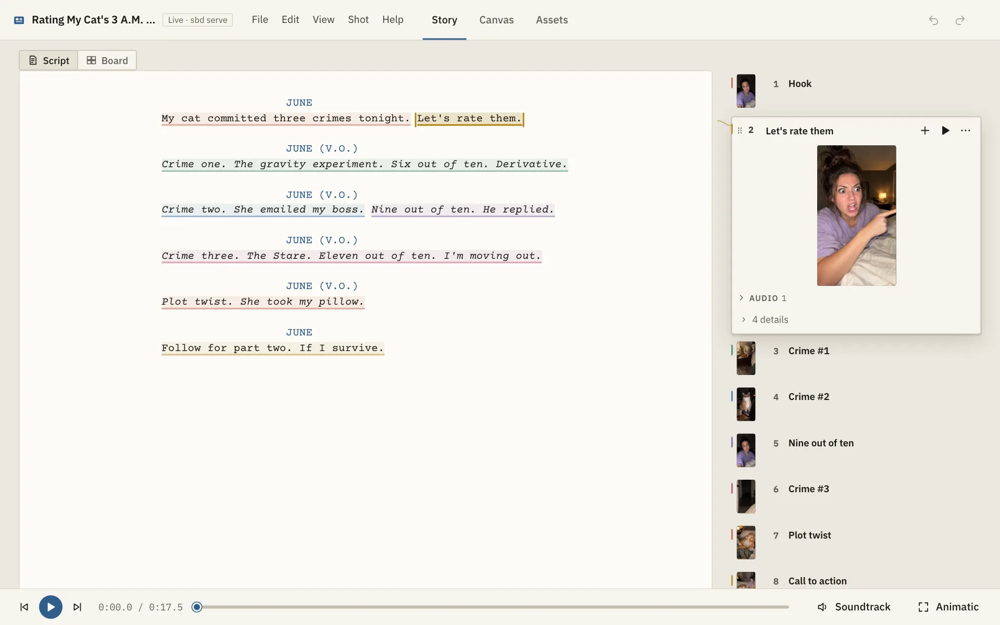
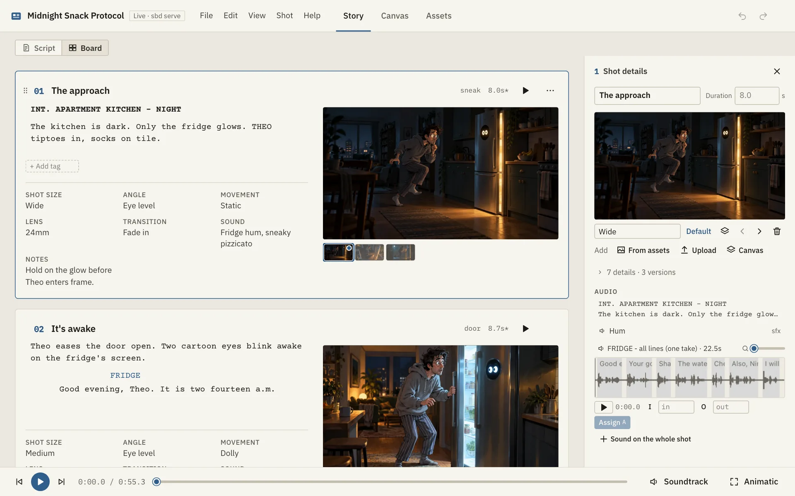
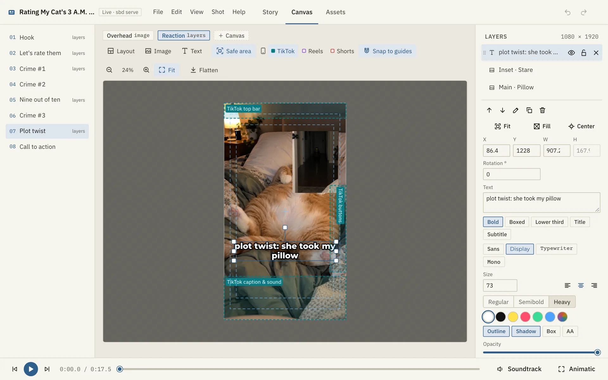
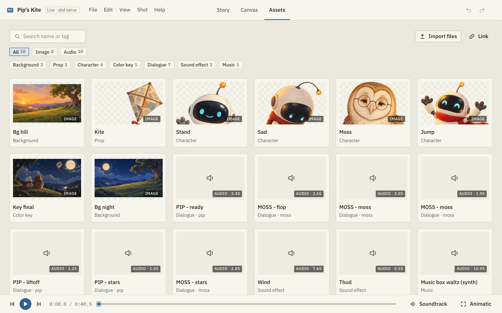
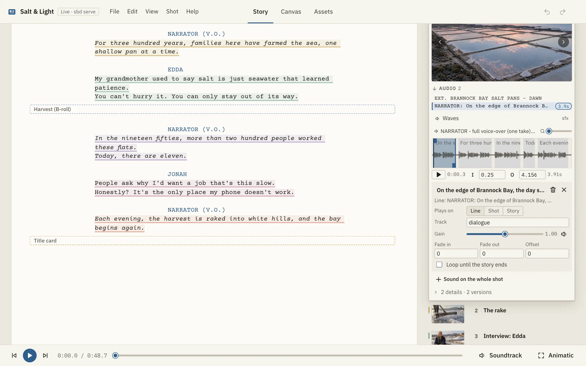
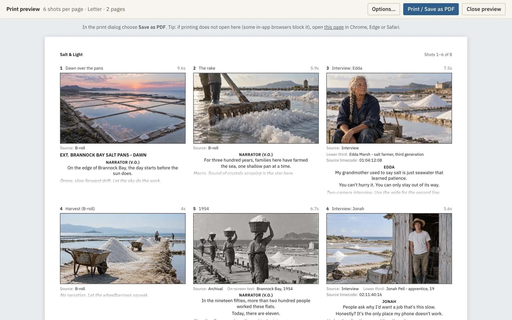

<div align="center">


# Storyboard Viewer

**Plan your video shot by shot. Your AI agent does the busywork, and you watch every change
appear live.**

[](LICENSE)
[](https://github.com/swaymun/storyboard-viewer/actions/workflows/ci.yml)


### [Open the app in your browser][app] · [Set it up with your AI agent](#use-it-with-your-ai-agent)

<picture>
  <source media="(prefers-color-scheme: dark)" srcset="docs/images/story-dark.webp" />
  
</picture>

</div>

## What it is

Storyboard Viewer is a free storyboard app for any kind of video: short films, documentaries,
animation, brand videos and vertical TikTok / Reels / Shorts. You write the script, mark which
words go with which shot, and add pictures, voice-over and music. Tell your AI agent (Claude Code
or Codex) what you want and it builds the storyboard for you while you watch. No account, no
cloud: your storyboards are ordinary files on your computer.

- **Watch your agent work.** Its changes show up in the viewer within a second.
- **Script first.** Write like in a screenwriting app; select some words and press **Make shot**.
- **Pictures and sound per shot.** Layers on a canvas, alternate versions, voice clips per line.
- **Play it as an animatic.** Press Space to play the story with voice, music and effects.
- **Export.** PDF storyboard sheets, an MP4 animatic, the script, or one `.sbd` file to share.
- **Import.** [Fountain](https://fountain.io) scripts and
  [Storyboarder](https://wonderunit.com/storyboarder/) scenes.
- **Works offline,** with eight light and dark themes, and full keyboard support.

|                                                                              |                                                                               |
| ---------------------------------------------------------------------------- | ----------------------------------------------------------------------------- |
|                       |                               |
| **Script** — write the script; shots are marked on their words.              | **Board** — the classic storyboard: one card per shot, script beside picture. |
|                                        |                                         |
| **Canvas** — arrange pictures in layers: move, scale, rotate, crop, filters. | **Assets** — all images, sounds, videos and fonts, sorted into categories.    |
|                             |                                            |
| **Audio** — each shot's sound; cut one recording into pieces, one per line.  | **Print / PDF** — storyboard sheets with 3, 6, 9 or 12 shots per page.        |

## Try it now

**[Open the app in your browser][app]**: nothing to install. Click **Try an example**, open a
`.sbd` file or folder, or start a new storyboard.

- Your files stay on your computer. Nothing is uploaded.
- After the first visit it works offline. In Chrome or Edge you can install it as an app (the
  install icon in the address bar).
- To let your AI agent edit storyboards while you watch, set it up on your computer (next
  section).

## Use it with your AI agent

You need [Claude Code](https://claude.com/claude-code) or
[Codex](https://developers.openai.com/codex) (desktop app or terminal).

1. **Copy** the prompt below (use the copy button in the top-right corner of the box).
2. **Paste** it into a new chat with your agent and send it.
3. **Approve** the commands it asks to run. It installs everything, makes your first storyboard
   and opens it for you.

```text
Please set up Storyboard Viewer for me. I may not be technical, so explain what you are doing in
plain, friendly words and ask before doing anything unusual.

Storyboard Viewer is a free, open-source storyboard app that runs on this computer. You (the
agent) edit storyboards through its MCP server, and I watch the changes appear in the viewer.
Repository: https://github.com/swaymun/storyboard-viewer

1. Check the tools. Run `node --version` and `git --version`.
   - Node.js must be version 20.19 or newer. If it is missing or older, help me install the LTS
     version from https://nodejs.org (or with Homebrew / winget / my package manager if I have
     one), then check again.
   - If git is missing, help me install it (on a Mac: `xcode-select --install`).
2. Pick a folder. Use ~/storyboard-viewer unless I say otherwise. If that folder already contains
   the project, use it and run `git pull` instead of cloning.
   Otherwise clone the repository address above: `git clone <repository> ~/storyboard-viewer`
3. Install and build (inside that folder). Use the pnpm version the project expects, without
   installing anything globally:
   `npx -y pnpm@8.15.6 install` then `npx -y pnpm@8.15.6 build`
   Then check the command line works: `node packages/cli/dist/cli.js --version`
4. Connect yourself to Storyboard Viewer (an MCP server named "storyboard"). Use the full,
   absolute path of the folder from step 2 in place of <REPO>:
   - If you are Claude Code:
     `claude mcp add storyboard --scope user -- node <REPO>/packages/cli/dist/cli.js mcp --serve`
   - If you are Codex:
     `codex mcp add storyboard -- node <REPO>/packages/cli/dist/cli.js mcp --serve`
   If the command's options look different, check `claude mcp add --help` or
   `codex mcp add --help` and adapt. If a server called "storyboard" already exists, ask me
   before replacing it.
5. Create my first storyboard. Ask me what I want to make (for example a short film, a
   documentary, an animation, a brand/motion video, or a vertical TikTok/Reels video) and its
   title, then create it in ~/Storyboards (make the folder if needed):
   `node <REPO>/packages/cli/dist/cli.js new ~/Storyboards/<short-name>.sbd --preset <preset> --title "<Title>"`
   Presets: film, documentary, animation, motion, vertical, blank.
6. Show me the viewer. The MCP connection from step 4 only becomes active in a new session, so
   for now start the viewer directly (keep it running in the background):
   `node <REPO>/packages/cli/dist/cli.js serve ~/Storyboards/<short-name>.sbd`
   It prints a link like http://localhost:4400/.
   - If you are running inside the Claude desktop app or the Codex desktop app and you can open
     pages in the in-app browser, open that link there so I can see the storyboard side by side
     with our chat.
   - Otherwise, give me the link and tell me to open it in Chrome, Edge or Safari.
7. Finish by telling me, in a few short sentences:
   - where Storyboard Viewer is installed and where my storyboard is saved;
   - that next time I can start a new chat and simply ask, for example: "Open my storyboard
     ~/Storyboards/<short-name>.sbd and show it to me", and you will use the storyboard tools and
     give me the viewer link (from get_viewer_url);
   - three example things I can ask for next, such as "Add five shots for the opening scene".
```

What each step does is explained in [docs/SETUP_PROMPT.md](docs/SETUP_PROMPT.md).

**Tip:** in the Claude or Codex desktop app, ask your agent to open the viewer in the in-app
browser. The storyboard then sits next to your chat and refreshes as the agent works.

Then just say what you want, in your own words:

- "Make a 30-second TikTok storyboard about a cat who hates Mondays. Six shots, punchy captions."
- "Turn this script into a storyboard, one shot per paragraph." _(paste it, or point to a file)_
- "Attach `~/Downloads/vo.mp3` and split it across the lines of shots 1 to 4."
- "Add quiet background music under the whole story, with a fade-out at the end."
- "Check the storyboard for problems, fix what you can, and export a PDF with six shots per page."

The agent can't _draw_ by itself, but it can place pictures you give it (or ones made with an
image tool) into shots, arrange layers on the canvas and keep everything in order.

## Example storyboards

Five ready-made storyboards with pictures, voices, music and sound effects live in
[`examples/`](examples/README.md). Two of them are under **Try an example** in the
[browser app][app].

<p align="center">
  
</p>

| Example                                                       | Kind                         |
| ------------------------------------------------------------- | ---------------------------- |
| [Midnight Snack Protocol](examples/midnight-snack.sbd)        | Comedy short                 |
| [Salt & Light](examples/salt-and-light.sbd)                   | Documentary                  |
| [Rating My Cat's 3 A.M. Crimes](examples/cat-crimes.sbd)      | TikTok / Reels / Shorts      |
| [Fernlight Halo — Launch Film](examples/fernlight-launch.sbd) | Motion design / brand launch |
| [Pip's Kite](examples/pips-kite.sbd)                          | Animation                    |

Everything in them is made up; all pictures and sounds were generated for this project.

## Tips and shortcuts

| Key                                   | What it does                              |
| ------------------------------------- | ----------------------------------------- |
| **Space**                             | Play / pause the animatic                 |
| **J** / **K**                         | Next / previous shot                      |
| **1** **2** **3**                     | Story, Canvas, Assets tab                 |
| **Cmd/Ctrl+Enter**                    | Make a shot from the selected words       |
| **Cmd/Ctrl+Z** / **Shift+Cmd/Ctrl+Z** | Undo / redo                               |
| **Cmd/Ctrl+S**                        | Save                                      |
| Right-click or **Shift+F10**          | Commands for a script line, shot or asset |
| **?**                                 | All keyboard shortcuts                    |

The [user guide](docs/GUIDE.md) explains everything else: the script editor, shots, audio,
saving, the recent list, themes and the `sbd` command.

## The .sbd file, in plain words

A storyboard is a **folder whose name ends in `.sbd`**, full of plain files: the script (a
normal screenplay file), one small file per shot, and a `media/` folder with the pictures and
sounds. Because it is just files, it works well with backups, cloud folders and git, and agents
can read it.

To share a storyboard as **one file**, use File → Export .sbd file (or `sbd pack`). That file is
a zip, and the app opens it directly. The full format is in [SPEC.md](SPEC.md); agents should
read [AGENTS.md](AGENTS.md).

## For developers

Requirements: [Node.js](https://nodejs.org) 20.19 or newer, git, and pnpm 8 (or
`npx pnpm@8.15.6` in place of `pnpm`).

```sh
git clone https://github.com/swaymun/storyboard-viewer.git
cd storyboard-viewer
pnpm install && pnpm build

pnpm sbd new ~/Storyboards/my-film.sbd --preset film --title "My Film"
pnpm sbd serve ~/Storyboards/my-film.sbd --open      # the viewer, with live refresh

# connect your agent (use the absolute path of your clone)
claude mcp add storyboard --scope user -- node /path/to/storyboard-viewer/packages/cli/dist/cli.js mcp --serve
codex mcp add storyboard -- node /path/to/storyboard-viewer/packages/cli/dist/cli.js mcp --serve
```

All `sbd` commands and the MCP setup for other clients are in the
[user guide](docs/GUIDE.md#the-sbd-command). Tests, code layout and deploying the browser app
are in [CONTRIBUTING.md](CONTRIBUTING.md). Changes are listed in [CHANGELOG.md](CHANGELOG.md).

## FAQ

**Do I need an AI agent?**
No. Use the [browser app][app], or `pnpm sbd serve <storyboard>`, and edit everything by hand.
The agent just makes the big jobs faster.

**Where are my storyboards stored?**
Wherever you (or your agent) create them, for example `~/Storyboards/my-film.sbd`. Nothing is
uploaded anywhere, also not from the browser app.

**Does it work offline?**
Yes. After setup (or the first visit to the browser app) nothing needs the internet.

**Which browsers work?**
Chrome and Edge are fully supported, including the in-app browsers of the Claude and Codex
desktop apps. Safari and Firefox should work for viewing and playback but are not tested yet.
Opening a folder in the browser app needs Chrome or Edge.

**My agent says it has no storyboard tools.**
The connection becomes active in a new chat. Start a new session, or check with
`claude mcp list` / `codex mcp list`.

**How do I update?**
Ask your agent "Update Storyboard Viewer", or run `git pull && pnpm install && pnpm build` in the
project folder. The browser app updates itself.

More answers (read-only files, safety) are in the [user guide](docs/GUIDE.md#more-questions).
Found a bug or have an idea? [Open an issue](https://github.com/swaymun/storyboard-viewer/issues).
Contributions are welcome: see [CONTRIBUTING.md](CONTRIBUTING.md) and the
[Code of Conduct](CODE_OF_CONDUCT.md).

## Credits

- The Maomao and Jinshi themes are adapted from
  [Apothecary Diary](https://github.com/montemurro19/apothecary-diary-theme), a VS Code theme by
  Matheus Montemurro, used under the MIT License (Copyright (c) 2025 Matheus Montemurro; the full
  notice is in [`apps/web/src/themes.css`](apps/web/src/themes.css)). It is a fan-made, unofficial
  work inspired by the anime; names and characters belong to their respective owners.
- Fonts: [IBM Plex Sans and Mono](https://github.com/IBM/plex) and
  [Courier Prime](https://quoteunquoteapps.com/courierprime/) (SIL Open Font License), bundled via
  Fontsource.
- Built with [Svelte](https://svelte.dev), [Konva](https://konvajs.org) (MIT),
  [CodeMirror](https://codemirror.net) (MIT), [fflate](https://github.com/101arrowz/fflate)
  (MIT), [hls.js](https://github.com/video-dev/hls.js) (Apache-2.0),
  [Mediabunny](https://mediabunny.dev) (MPL-2.0, unmodified, for video export), the
  [MCP TypeScript SDK](https://github.com/modelcontextprotocol/typescript-sdk) (MIT) and
  [Playwright](https://playwright.dev) (Apache-2.0, for `sbd export-pdf`). Fountain is a
  plain-text screenplay format by [fountain.io](https://fountain.io). Storyboarder is by
  [Wonder Unit](https://wonderunit.com).

## License

[MIT](LICENSE)

[app]: https://storyboard-viewer.saimun-shahee.workers.dev
